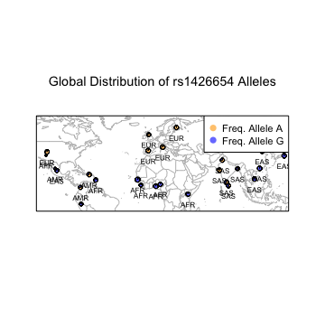

1. Installing packages
```r
> library(maps)
> library(mapdata)
> library(scales)
> library(mapplots)
```
2. World Map
```r
> map('worldHires', xlim=c(-120,142), ylim=c(-12,72), col='gray', fill=FALSE)
> box()
```
<center>
</img>
</center>

3.Human Population plot
```r
> map('worldHires', xlim=c(-120,142), ylim=c(-12,72), col='gray', fill=FALSE)
> points(freq$long, freq$lat, pch=16, col="salmon")
> box()
```
<center>
</img>
</center>

4. Allele frequency by pie chart
```r

> map('worldHires', xlim=c(-120,142), ylim=c(-12,72), col='gray', fill=FALSE)
> points(freq$long, freq$lat, pch=16, cex=freq$Allele_A*1.5, col="salmon")
> box()
```
<center>
</img>
</center>

5.Plot for all pie charts using {} for loop
```r
> map('worldHires', xlim=c(-120,142), ylim=c(-12,72), col='gray', fill=FALSE)
> add.pie(z=c(0.104, 0.895), x=-59.5412, y=13.1776, radius=192/100, 
          +         col=c(alpha("orange", 0.6), alpha("blue", 0.6)), labels="")
> box()
```
<center>

</center>

6. Adding legend and label population
```r
map('worldHires', xlim=c(-120,142), ylim=c(-15,72), col='gray', fill=FALSE)
> for (i in 1:26){add.pie(z=c(freq$Allele_A[i], freq$Allele_G[i]), x=freq$long[i], y=freq$lat[i], 
                          +                         radius=freq$N_CHR[i]/100, col=c(alpha("orange", 0.6), alpha("blue", 0.6)), labels="")
  +     i=i+1
  + }
> box()
> map('worldHires', xlim=c(-120,142), ylim=c(-15,72), col='gray', fill=FALSE)
> for (i in 1:26){
  +     add.pie(z=c(freq$Allele_A[i], freq$Allele_G[i]), x=freq$long[i], y=freq$lat[i], 
                +             radius=freq$N_CHR[i]/100, col=c(alpha("orange", 0.6), alpha("blue", 0.6)), labels="")
  +     i=i+1
  + }
> text(freq$long, freq$lat, labels=freq$superpop, cex=0.5, pos=1)
> box()
> legend('topright', bty='1', c("Freq. Allele A", "Freq. Allele G"), 
         +        pch=16, col=c(alpha("orange", 0.6), alpha("blue", 0.6)), pt.cex=1, cex=0.7)
> title(main="Global Distribution of rs1426654 Alleles", font.main=1, cex.main=0.9)
```
<center>
</img>
</center>

